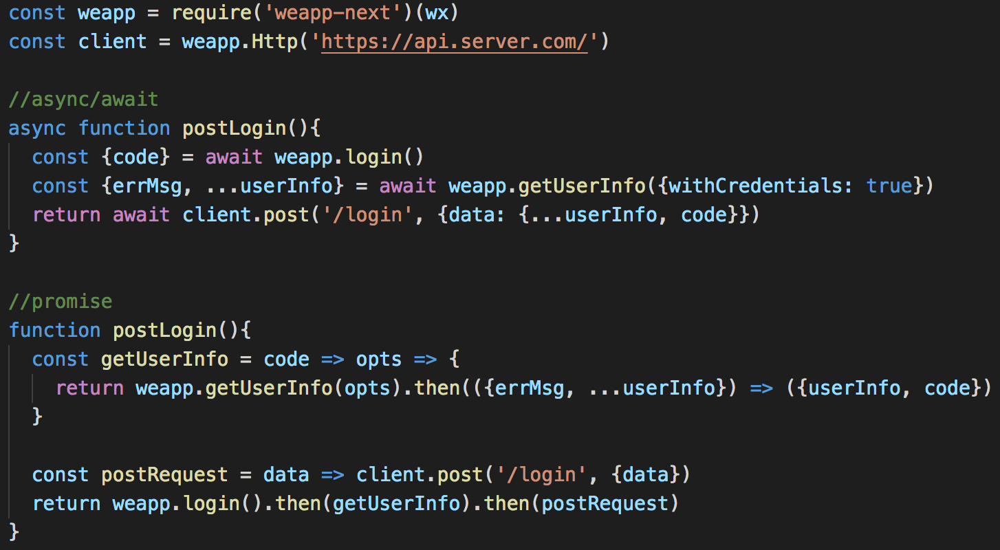

# weapp-next

Weapp(微信小程序) official API wrapper, purpose to expose fashionable, friendly and fluent programming API.

[](https://travis-ci.org/xixilive/weapp-next)



## Features

- Promisified async API

- Shortcuts for `wx.request` API

- Enhancements official APIs

- RESTful http client

## Install

```
# via Github
npm i xixilive/weapp-next --save-dev
```

```
# via npm
npm i weapp-next --save-dev
```

## Examples

### non-callback and RESTful HTTP

```js
const weapp = require('weapp-next')(wx)
const client = weapp.Http('https://api.server.com/')

//async/await
async function postLogin(){
  const {code} = await weapp.login()
  const {errMsg, ...userInfo} = await weapp.getUserInfo({withCredentials: true})
  return await client.post('/login', {data: {...userInfo, code}})
}

//promise
function postLogin(){
  const getUserInfo = code => opts => {
    return weapp.getUserInfo(opts).then(({errMsg, ...userInfo}) => ({userInfo, code})
  }

  const postRequest = data => client.post('/login', {data})
  return weapp.login().then(getUserInfo).then(postRequest)
}
```

## Usage

`weapp-next` use UMD module system, you can load it in Commonjs or AMD format.

```js
import weapp from 'weapp-next'

// get wrapped wx Object
const {request, Http} = weapp(wx)

// use request API
request({url: 'https://test.com', method: 'GET'}).then(response => console.log)

// use shortcuts of request API, such as get, post, put, etc.
request.get('https://test.com').then(response => console.log)

// use Http client
const http = Http('https://server.com/api')
http.get('/path').then(response => console.log)

// or
const weapp = require('weapp-next')(wx)
```

Wraps almost all of official APIs, see [Wrapped methods](./docs/METHODS.md)

## Enhancements

Create http request shortcuts according to wechat mini-program declared verbs(RFC 2616). specially, the `PATCH` verb maybe useful for strict RESTful-ist, and so it has defined also.

### `weapp.request`

It resolves a response which take a statusCode in range of [200, 300), and reject a response which out of the range.

The resolved response and rejected reason/error is the response object from the native `wx.request`.

```js
import weapp from 'weapp-next'
const {request} = weapp(wx)

request({url, method: 'GET'})
  .then(response => {
    // response is the response object from wx.request
  })
  .catch(error => {
    // error is the response object from wx.request
  })

request.get(url:String [, init:Function])
request.post(url:String, body:String/Object, [, init:Function])
request.put(url:String, body:String/Object, [, init:Function])
request.patch(url:String, body:String/Object, [, init:Function])
request.delete(url:String [, init:Function])
request.head(url:String [, init:Function])
request.options(url:String [, init:Function])
request.trace(url:String [, init:Function])
request.connect(url:String [, init:Function])
```

Optional `init` argument is a zero-arugments function to interpolate request parameters, and it expects to return an Object value by contract. you can override any request params by the returned object except the `url` and `method`.

```js
// logic of init function
const config = {...}
return {...config, ...init(), url, method}
```

### `weapp.requireAuth` (DPRECIATED)

> DPRECIATED

Here is a Express middleware for weapp login scenario which purpose to make it easy to integrate weapp login and getUserInfo logic. [express-weapp-auth](https://github.com/xixilive/express-weapp-auth)

## Use RESTful Http client

```js
import weapp from 'weapp-next'

const http = weapp(wx).Http('https://api.server.com/')
http.get('/status', {version: '1'}) // /status?version=1
http.post('/status', {data: {}})
```

## Changes

[Change log](./CHANGELOG.md)